# 🏢 Employee Lifecycle Platform on Kubernetes

> Automated employee onboarding and offboarding platform on AWS using Kubernetes, Terraform, Cognito, Active Directory and WorkSpaces, designed with Zero Trust and least-privilege principles.

[](https://opensource.org/licenses/MIT)
[](https://www.terraform.io/)
[](https://kubernetes.io/)
[](https://aws.amazon.com/)

## 📋 Table of Contents

- [Overview](#-overview)
- [Architecture](#-architecture)
- [Key Features](#-key-features)
- [Technology Stack](#-technology-stack)
- [Demo:  Onboarding Flow](#-demo-onboarding-flow)
- [Demo: Offboarding Flow](#-demo-offboarding-flow)
- [Security Architecture](#-security-architecture)
- [Infrastructure Components](#-infrastructure-components)
- [Getting Started](#-getting-started)
- [Repository Structure](#-repository-structure)
- [Cost Management](#-cost-management)
- [Monitoring & Observability](#-monitoring--observability)

---

## 🎯 Overview

This project demonstrates a **production-ready employee lifecycle management platform** deployed on AWS using cloud-native technologies. It automates the complete onboarding and offboarding process, integrating authentication, directory services, virtual desktop infrastructure (VDI), and role-based access control (RBAC).

### What Problem Does It Solve?

Manual employee onboarding/offboarding is: 
- **Time-consuming**: Multiple systems to configure per employee
- **Error-prone**:  Manual steps can be missed or misconfigured
- **Security risk**: Delayed offboarding leaves access exposed
- **Not scalable**:  Doesn't scale with organizational growth

This platform **automates the entire lifecycle** in seconds with zero manual intervention.

---

## 🏗️ Architecture

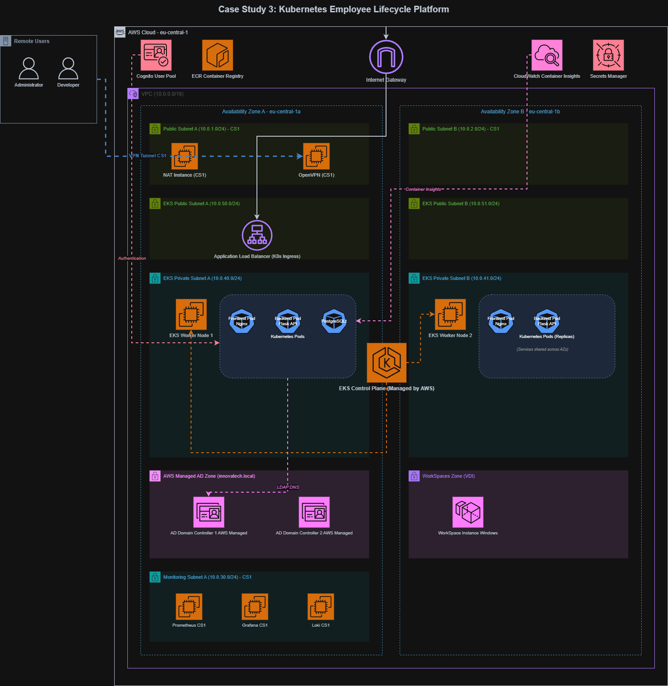

### Architecture Highlights

- **Multi-tier application** running on AWS EKS (Elastic Kubernetes Service)
- **Zero Trust security model** with network micro-segmentation via Kubernetes NetworkPolicies
- **Identity integration** with AWS Cognito for authentication and AWS Managed Microsoft AD for directory services
- **Infrastructure as Code** with Terraform for reproducible deployments
- **Self-healing** Kubernetes deployments with automated pod recovery
- **Cost-optimized** using Spot instances, NAT instances, and right-sized resources

---

## ✨ Key Features

### 🚀 Automated Onboarding
When an admin creates a new employee through the self-service portal, the platform automatically: 

1. ✅ Creates a database record in PostgreSQL
2. ✅ Provisions AWS Cognito user with appropriate group assignment
3. ✅ Creates Active Directory user in the correct Organizational Unit (OU)
4. ✅ Provisions Amazon WorkSpace (VDI) for the employee
5. ✅ Applies role-based tooling and GPO policies based on department
6. ✅ Sends welcome email with credentials (configurable)

**⏱️ Total time:  < 5 minutes (fully automated)**

### 🔒 Automated Offboarding
When an employee is terminated, the platform securely:

1. ✅ Removes employee from the database
2. ✅ Disables Cognito user account
3. ✅ Disables Active Directory account
4. ✅ Terminates Amazon WorkSpace
5. ✅ Revokes all access permissions
6. ✅ Logs offboarding event for audit trail

**⏱️ Total time: < 2 minutes (fully automated)**

### 🛡️ Security Features

- **Zero Trust Architecture**: Network micro-segmentation with Kubernetes NetworkPolicies
- **Least Privilege**:  RBAC with Cognito groups (Admin, Developer, Employee)
- **Encryption**: Data encrypted at rest and in transit
- **Audit Logging**: CloudWatch logs for all lifecycle events
- **MFA Support**:  Cognito MFA for administrative access
- **Private Networking**: EKS nodes in private subnets with NAT gateway

---

## 🛠️ Technology Stack

| Layer | Technology | Purpose |
|-------|-----------|---------|
| **Infrastructure** | Terraform | Infrastructure as Code (IaC) |
| **Container Orchestration** | AWS EKS (Kubernetes) | Container management and orchestration |
| **Authentication** | AWS Cognito | User authentication and RBAC |
| **Directory Services** | AWS Managed Microsoft AD | Active Directory integration |
| **Virtual Desktop** | Amazon WorkSpaces | VDI provisioning |
| **Database** | PostgreSQL (on Kubernetes) | Employee data storage |
| **Backend** | Python/Flask | REST API for lifecycle operations |
| **Frontend** | HTML/JavaScript/Nginx | Self-service web portal |
| **Monitoring** | Prometheus + Grafana + Loki | Metrics, logs, and dashboards |
| **Networking** | VPC, SecurityGroups, NetworkPolicies | Network isolation and security |
| **CI/CD** | Amazon ECR | Container registry |

---

## 📸 Demo: Onboarding Flow

### Step 1: Admin Creates Employee
Admin fills out the employee creation form with department and role. 

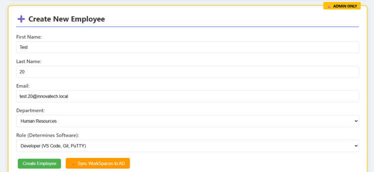

---

### Step 2: Employee Record Created
Employee appears immediately in the directory with "Active" status.


---

### Step 3: Backend Confirms Provisioning
Backend API returns successful response with all provisioning steps completed.


---

### Step 4: Cognito User Created
AWS Cognito user created and enabled with correct group membership.

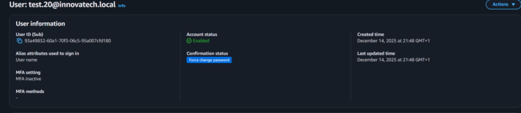

---

### Step 5: Active Directory User Created
AD user created in the correct Organizational Unit (OU) based on department.

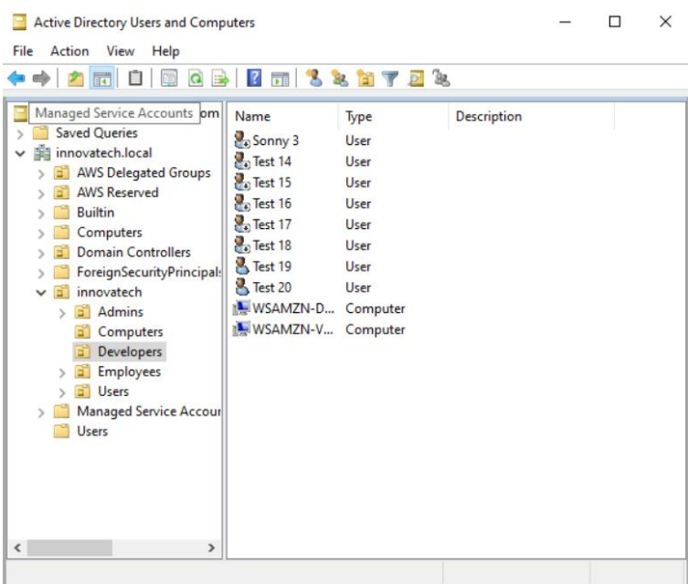

---

### Step 6: WorkSpace Provisioning
Amazon WorkSpace provisioning starts automatically.

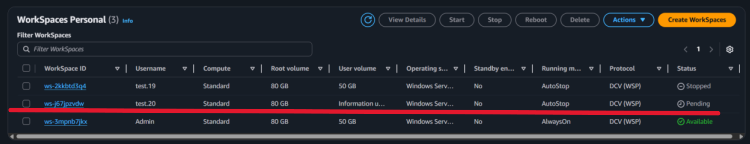

---

### Step 7: Role-Based Tooling Installed
WorkSpace configured with role-specific applications (VS Code, Git, PuTTY for Developers).

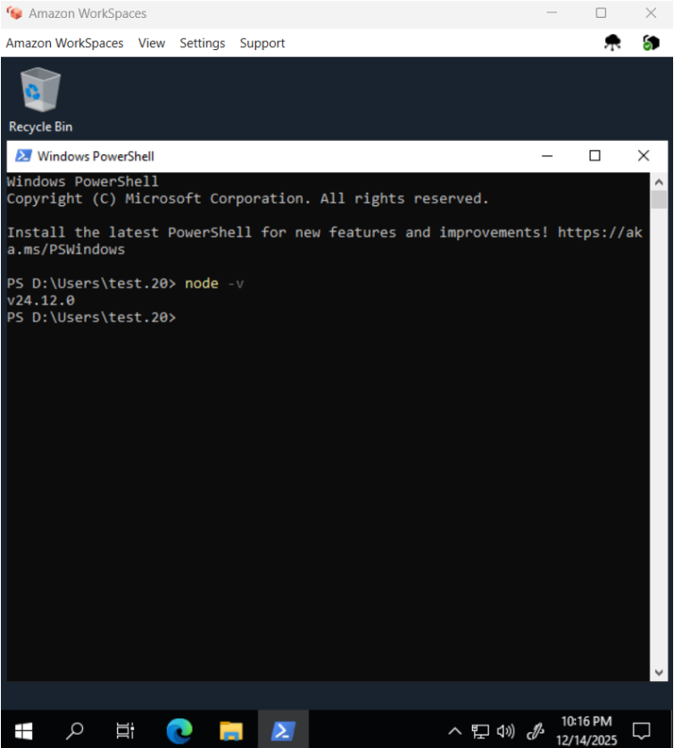

---

## 📸 Demo: Offboarding Flow

### Step 1: Initiate Offboarding
Admin clicks "Terminate" on employee record.

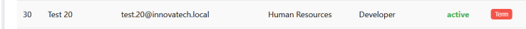

---

### Step 2: Offboarding Confirmation
Success message confirms offboarding initiated.

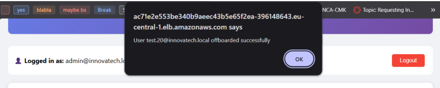

---

### Step 3: Database Record Removed
Employee removed from PostgreSQL database.

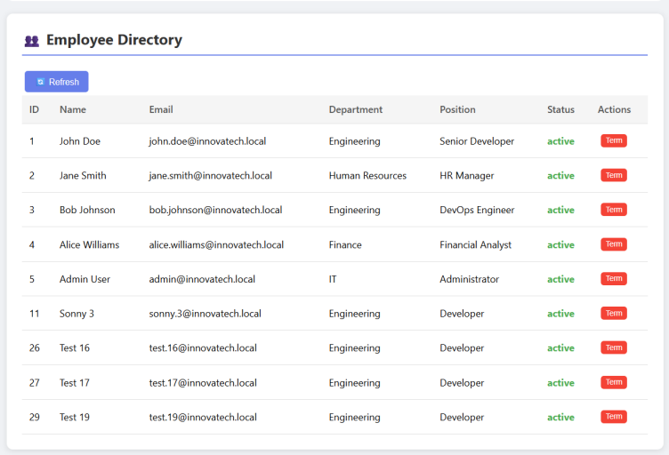

---

### Step 4: Cognito User Disabled
AWS Cognito user account disabled (authentication blocked).

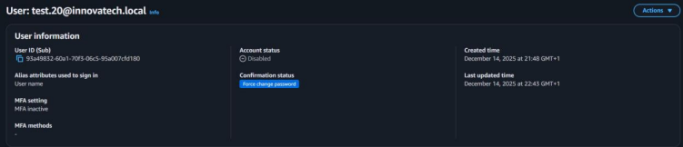

---

### Step 5: Active Directory User Disabled
AD account disabled (network access revoked).

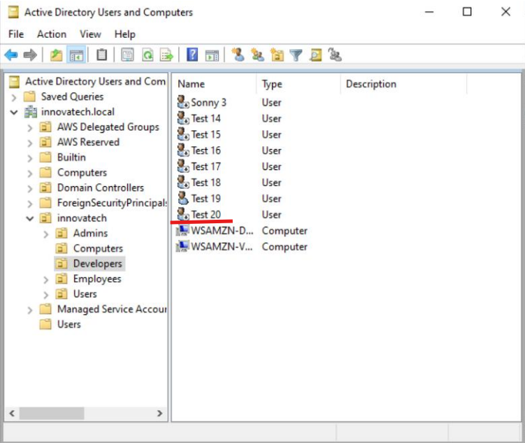

---

### Step 6: WorkSpace Terminating
Amazon WorkSpace enters "Terminating" state. 

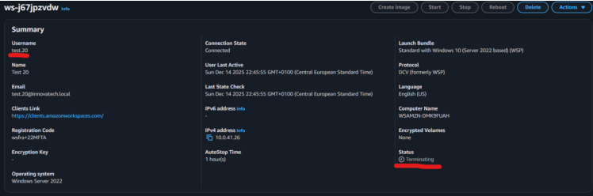

---

### Step 7: WorkSpace Terminated
WorkSpace fully terminated and resources released.

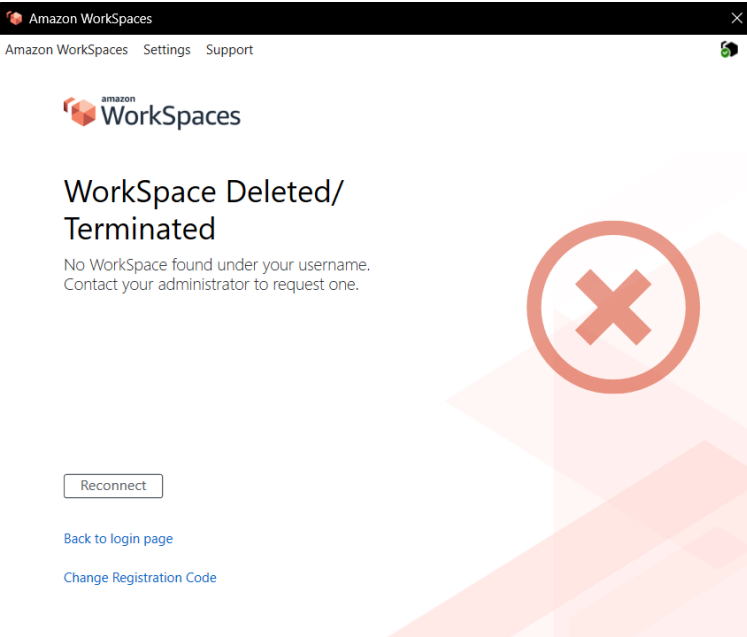

---

## 🔐 Security Architecture

### Cognito Groups and RBAC

The platform implements **role-based access control** using AWS Cognito groups:

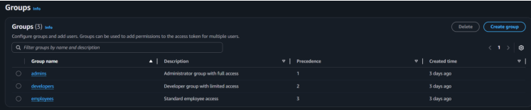

| Group | Permissions | Portal Access |
|-------|------------|---------------|
| **Admins** | Create/terminate employees, approve access requests | Full access |
| **Developers** | View directory, request access | Limited access |
| **Employees** | View own profile, request access | Read-only |

---

### Kubernetes Network Micro-segmentation

Network access is restricted using **Kubernetes NetworkPolicies** to enforce Zero Trust principles:


#### Network Policy Rules:
- Frontend can only communicate with backend on port 5000
- Backend can only access PostgreSQL on port 5432
- Database accepts connections only from backend pods
- Default deny policy for all other traffic

---

### Security Best Practices Implemented

✅ **Encryption at rest** (EBS volumes, RDS)  
✅ **Encryption in transit** (TLS for all API calls)  
✅ **Private subnets** for EKS nodes and database  
✅ **Security groups** with least-privilege rules  
✅ **IAM roles** for service accounts (IRSA)  
✅ **Secrets management** via Kubernetes Secrets  
✅ **CloudWatch logging** for audit trails  
✅ **MFA enforcement** for admin accounts  

---

## 🧩 Infrastructure Components

### Networking
- **VPC**: 10.0.0.0/16 with public and private subnets across 2 AZs
- **NAT Instance**: Cost-optimized NAT for private subnet internet access
- **Security Groups**:  Granular firewall rules for each component
- **Route53**: Private hosted zone for internal DNS

### Compute
- **EKS Cluster**:  Kubernetes 1.28 with managed control plane
- **Node Group**: Auto-scaling worker nodes (2-4 nodes, t3.medium)
- **Spot Instances**: Cost savings for non-critical workloads
- **Amazon WorkSpaces**: VDI for employees (role-based bundles)

### Identity & Access
- **AWS Cognito**: User pool with RBAC groups
- **AWS Managed Microsoft AD**: Directory services for WorkSpaces
- **IAM Roles**: Service accounts for EKS pods (IRSA)

### Data
- **PostgreSQL**: Stateful employee database on Kubernetes
- **Persistent Volumes**: EBS-backed storage for database
- **Backup Strategy**:  Automated snapshots (configurable)

### Monitoring
- **Prometheus**:  Metrics collection and alerting
- **Grafana**: Visualization dashboards
- **Loki**:  Log aggregation
- **CloudWatch**: AWS service metrics and logs

---

## 🚦 Reliability Evidence

### Self-Healing Kubernetes Deployment

Kubernetes automatically recreates failed pods:


**Demo**:  Deleting a pod triggers the Deployment controller to recreate it within seconds, ensuring zero downtime.

---

## 🚀 Getting Started

### Prerequisites

Before you begin, ensure you have: 

- **AWS Account** with sufficient permissions
- **Terraform** 1.6+ installed
- **AWS CLI** configured with credentials
- **kubectl** installed
- **Docker** (for building container images)
- **PowerShell** 7+ (for setup scripts)

### Installation Steps

#### 1. Clone the Repository

```bash
git clone https://github.com/Sonny-He/employee-lifecycle-platform-kubernetes. git
cd employee-lifecycle-platform-kubernetes
```

#### 2. Configure Terraform Variables

Edit `terraform/terraform.tfvars`:

```hcl
aws_region         = "eu-central-1"  # Your AWS region
project_name       = "employee-lifecycle"
environment        = "production"
eks_cluster_name   = "employee-platform-eks"

# Cost management
budget_alert_emails = ["your-email@example.com"]
monthly_budget_limit = 200

# Domain configuration (optional)
# domain_name = "yourdomain.com"
```

#### 3. Deploy Infrastructure

```bash
cd terraform

# Initialize Terraform (first time only)
terraform init

# Review the plan
terraform plan

# Deploy infrastructure (takes ~20 minutes)
terraform apply -auto-approve
```

#### 4. Run Post-Deployment Setup

This script configures kubectl, ECR, database, and Cognito:

```powershell
cd automation/scripts
./post-deployment-setup1.ps1 -AWS_PROFILE student
```

The script will:
- Configure kubectl to access EKS cluster
- Create ECR repositories
- Build and push Docker images
- Initialize PostgreSQL database schema
- Create Cognito admin user
- Deploy Kubernetes manifests

#### 5. Access the Portal

After setup completes, get the portal URL:

```bash
kubectl get svc -n employee-services
```

Open the LoadBalancer URL in your browser and login with: 
- **Username**: `admin`
- **Password**: `AdminPass123!` (change this in production!)

---

## 📁 Repository Structure

```plaintext
employee-lifecycle-platform-kubernetes/
│
├── terraform/                      # Infrastructure as Code
│   ├── provider.tf                 # AWS provider configuration
│   ├── variables.tf                # Input variables
│   ├── network.tf                  # VPC, subnets, routing
│   ├── cs3-eks. tf                  # EKS cluster and node groups
│   ├── cs3-cognito.tf              # Cognito user pool
│   ├── cs3-active-directory.tf     # AWS Managed Microsoft AD
│   ├── cs3-workspaces.tf           # WorkSpaces configuration
│   ├── cs3-cost-management.tf      # Budgets and cost alerts
│   ├── cs3-outputs.tf              # Terraform outputs
│   └── *. tf                        # Additional resources
│
├── kubernetes/                     # Kubernetes manifests
│   ├── namespace. yaml              # employee-services namespace
│   ├── database/                   # PostgreSQL StatefulSet
│   ├── backend/                    # Flask backend Deployment
│   ├── frontend/                   # Nginx frontend Deployment
│   ├── networkpolicy.yaml          # Network micro-segmentation
│   └── service. yaml                # LoadBalancer service
│
├── employee-portal/                # Application source code
│   ├── backend/                    # Python/Flask REST API
│   │   ├── app.py                  # Main application
│   │   ├── requirements.txt        # Python dependencies
│   │   └── Dockerfile              # Backend container
│   │
│   ├── frontend/                   # Web UI
│   │   ├── index.html              # Single-page application
│   │   ├── nginx.conf              # Nginx configuration
│   │   └── Dockerfile              # Frontend container
│   │
│   └── db/                         # Database schemas
│       └── init-employee-db.sql    # Initial schema and data
│
├── automation/scripts/             # Deployment automation
│   ├── post-deployment-setup1.ps1  # Main setup script
│   ├── post-deployment-setup2.ps1  # Secondary setup
│   └── *.ps1                       # Additional scripts
│
├── architecture/diagrams/          # Architecture diagrams
│   └── *.drawio                    # Draw.io source files
│
├── docs/screenshots/               # Documentation screenshots
│   ├── architecture/               # Architecture diagrams
│   ├── onboarding/                 # Onboarding flow evidence
│   ├── offboarding/                # Offboarding flow evidence
│   ├── rbac/                       # Security and RBAC
│   └── kubernetes/                 # Kubernetes operations
│
├── . github/                        # GitHub Actions (optional)
├── . gitignore                      # Git ignore rules
└── README.md                       # This file
```

---

## 💰 Cost Management

### Estimated Monthly Costs

| Resource | Cost (USD/month) | Notes |
|----------|-----------------|-------|
| EKS Control Plane | $73 | Flat rate |
| EKS Worker Nodes (2x t3.medium) | $60 | Spot instances available |
| NAT Instance (t3.nano) | $3.80 | Cost-optimized vs NAT Gateway (~$32) |
| AWS Managed Microsoft AD | $110 | Standard edition |
| Amazon WorkSpaces | ~$25/user | Usage-based pricing |
| PostgreSQL on Kubernetes | $0 | Runs on EKS nodes |
| CloudWatch, Secrets Manager | $5-10 | Variable based on usage |
| **Total (without WorkSpaces)** | **~$250** | |
| **Per-employee cost (WorkSpaces)** | **+$25** | |

### Cost Optimization Features

✅ **Budgets and Alerts**:  Configured in Terraform with email notifications  
✅ **Spot Instances**: Worker nodes use Spot for 70% cost savings  
✅ **NAT Instance**: $3.80/month vs $32/month NAT Gateway  
✅ **Right-sized Resources**: t3.medium nodes, db.t3.micro database  
✅ **Auto-scaling**: Scale down during off-hours  
✅ **WorkSpaces AutoStop**: Stop desktops after hours  

### View Current Costs

```bash
# Get current month costs
aws ce get-cost-and-usage \
  --time-period Start=$(date +%Y-%m-01),End=$(date +%Y-%m-%d) \
  --granularity DAILY \
  --metrics UnblendedCost \
  --profile student
```

---

## 📊 Monitoring & Observability

### Monitoring Stack

The platform includes a comprehensive monitoring solution:

- **Prometheus**: Scrapes metrics from EKS nodes, pods, and AWS services
- **Grafana**:  Pre-configured dashboards for infrastructure and application metrics
- **Loki**: Log aggregation from all Kubernetes pods
- **CloudWatch**: AWS service metrics and EKS control plane logs

### Accessing Monitoring (via VPN)

1. Connect to OpenVPN (server provisioned by Terraform)
2. Access Grafana:  `http://<monitoring-ip>:3000`
3. Default credentials: `admin / admin123`

### Pre-configured Dashboards

- EKS Cluster Overview
- Node Resource Utilization
- Pod Health and Logs
- AWS Service Costs
- Application Performance

### Useful Monitoring Commands

```bash
# View all pods
kubectl get pods -n employee-services

# View pod logs
kubectl logs -f <pod-name> -n employee-services

# View pod resource usage
kubectl top pods -n employee-services

# View node resource usage
kubectl top nodes

# Describe a pod
kubectl describe pod <pod-name> -n employee-services
```

---

## 🎓 Learning Outcomes

This project demonstrates proficiency in:

✅ **Cloud Architecture**:  Designing scalable, secure multi-tier applications on AWS  
✅ **Infrastructure as Code**: Terraform for reproducible infrastructure  
✅ **Container Orchestration**: Kubernetes deployment, scaling, and management  
✅ **Zero Trust Security**: Network segmentation, RBAC, least-privilege  
✅ **Identity Management**:  Cognito, Active Directory integration  
✅ **DevOps Practices**: CI/CD pipelines, GitOps, automation  
✅ **Cost Optimization**: Right-sizing, Spot instances, monitoring  
✅ **Observability**: Logging, metrics, tracing, alerting  

---

## 🤝 Contributing

This is a portfolio project, but suggestions and improvements are welcome! 

1. Fork the repository
2. Create a feature branch (`git checkout -b feature/improvement`)
3. Commit your changes (`git commit -am 'Add new feature'`)
4. Push to the branch (`git push origin feature/improvement`)
5. Open a Pull Request

---

## 📄 License

This project is licensed under the MIT License - see the [LICENSE](LICENSE) file for details.

---

## 👤 Author

**Sonny He**

- GitHub: [@Sonny-He](https://github.com/Sonny-He)
- LinkedIn: [Connect with me](www.linkedin.com/in/sonny-he-72830b38b)

---

## 🙏 Acknowledgments

- **Fontys University** - Cloud Native Architecture course
- **AWS** - Documentation and sample architectures
- **Kubernetes Community** - Best practices and patterns
- **HashiCorp** - Terraform documentation

---

## 📚 Additional Resources

- [AWS EKS Best Practices](https://aws.github.io/aws-eks-best-practices/)
- [Kubernetes Documentation](https://kubernetes.io/docs/)
- [Terraform AWS Provider](https://registry.terraform.io/providers/hashicorp/aws/latest/docs)
- [AWS Well-Architected Framework](https://aws.amazon.com/architecture/well-architected/)

---

<div align="center">

**⭐ If you find this project useful, please consider giving it a star! ⭐**

Made with ☕ and ❤️ by [Sonny He](https://github.com/Sonny-He)

</div>
